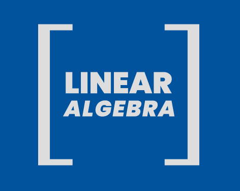

# [Linear Algebra](https://medium.com/linear-algebra)

  

Explaining the concepts of Linear Algebra, from Basics to Advanced. There will also be articles about their application in Computer Science. 

### PART 1   : [Linear Equation of two variables and Matrices](https://medium.com/linear-algebra/part-1-linear-equation-of-two-variables-and-matrices-d8de21eb8d51)  
### PART 2   : [Operations on Matrices](https://medium.com/linear-algebra/part-2-operations-on-matrices-3caab542aebd)  
### PART 3   : [Types of Matrices, Diagonal and Transpose](https://medium.com/linear-algebra/part-3-types-of-matrices-diagonal-and-transpose-151418a47c06)  
### PART 4A  : [List, Arrays and Matrices in Python3](https://medium.com/linear-algebra/part-4-list-arrays-and-matrices-in-python-3-6ee47b3a3d23) 
[Code](/lists-arrays-matrices/example.ipynb)
### PART 4B  : [Tensors, Scalars and Vectors](https://medium.com/linear-algebra/part-4b-tensors-scalars-and-vectors-68cf6c1f2be)  
 
### PART 5   : [Row picture and Column Picture](https://medium.com/linear-algebra/part-5-row-picture-and-column-picture-899e6d834564)  
### PART 6   : [Gaussian Elimination](https://medium.com/linear-algebra/part-6-gaussian-elimination-b1ad4a279a74)  
### PART 7   : [Inverses and Gauss Jordan Elimination](https://medium.com/linear-algebra/part-7-inverses-and-gauss-jordan-elimination-39c5162428e0)  
### PART 8   : [Linear Independence, Rank of Matrix and Span](https://medium.com/linear-algebra/part-8-linear-independence-rank-of-matrix-and-span-9f8af9bfd475)  
### PART 9   : [Vector Spaces and Subspaces](https://medium.com/linear-algebra/part-9-vector-spaces-and-sub-spaces-34c44c968ed5)  
### PART 10  : [Example of Subspaces](https://medium.com/linear-algebra/part-10-example-of-sub-spaces-e613bc062e56) 
### PART 11  : [Row space, Column Space and Null Space](https://medium.com/linear-algebra/part-11-row-space-column-space-and-null-space-d69319f22fc4)  
### PART 12  : [Vectors](https://medium.com/linear-algebra/part-12-vectors-a99364499121)  
### PART 13  : [Vector Components](https://medium.com/linear-algebra/part-13-vector-components-b78a61be3817)  
### PART 14  : [Dot and Hadamard Product](https://medium.com/linear-algebra/part-14-dot-and-hadamard-product-b7e0723b9133)  

